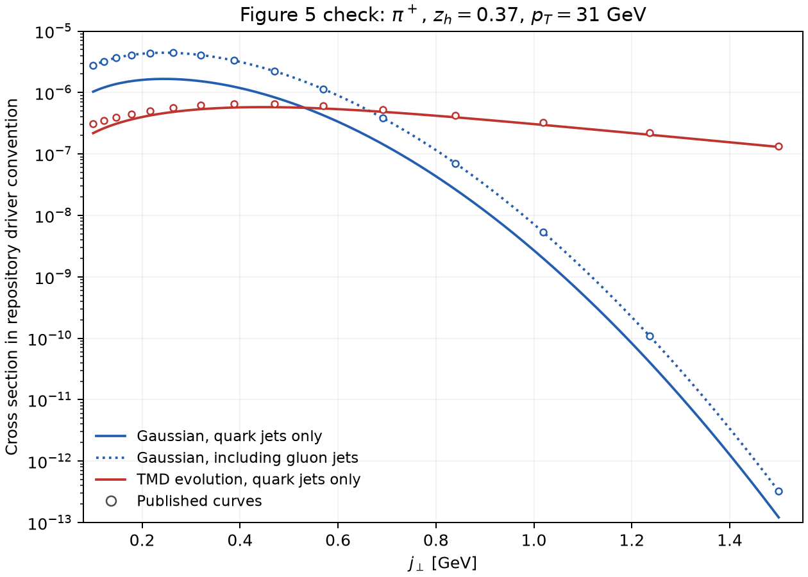

# Numerical audit, 26 September 2026

The ROOT-free wrapper passes the implementation checks below. The remaining
disagreement with arXiv:1707.00913v2 is unresolved. Agreement between two
implementations of the uploaded source does not establish that either uses
the exact settings that generated the 2017 figures.

## Inputs and scope

The audit uses upstream `3945b91086dd153b4d940531e2f09f8f70c0496f`, CT10nlo
member 0, DSSV-2008, the root `PINLO.GRID`, both KANG2015 central parameter
files, `g2=0.84`, `gh=0.042 GeV^2`, and the supplied Collins width
`gc=0.0236166... GeV^2`. The defaults are `sqrt(s)=500 GeV`, `pt=31 GeV`,
`0<y<1`, `xa,xb<0.99`, `0.001<b<10 GeV^-1`, and the repository's matching
and Sudakov conventions. Full parameter/source hashes are in
[run.json](example_results/central/run.json).

The tutorial explicitly initializes all HOPPET callback slots to zero before
filling them. The original callback did not set the gluon slot. It also
sets the outgoing gluon TMD to zero, consistent with the paper's stated
choice. The original nonperturbative FF structures leave that slot
uninitialized. Comparing against an arbitrary value from uninitialized
memory would not be a meaningful reproduction criterion.

The legacy driver in this snapshot is configured for later 200 GeV settings,
not for Figure 4. Its default unpolarized inputs are cteq6l1 and LO FFs,
and its initial default Collins/transversity fit selections differ. This
tutorial makes a coherent KANG2015 central choice explicitly. It has not
recovered the historical Figure 4 steering file.

## Independent check against the full original integrand

`prepare.py` extracts the complete
`sidis::approximate_pionjet_pp_calculation_NLO` and its nonperturbative
functions from `pionjet_pp.cpp`. The validation adapter supplies a small
`sidis`/hadron interface, maps the two ROOT Bessel calls to C math, and
zero-initializes the previously indeterminate NP fields. The original
matching convolution, sign conversion, hard contraction and `2pt*2jt`
factors execute in C++, independently of their Python counterparts.

Eight separately scrambled Sobol replicates, each with 65,536 points,
integrate all four variables `(y,xb,zhat,b)` together. This checks the
separation of hard and fragmentation integrals and the numerical method.
It shares LHAPDF, DSS, DSSV, HOPPET and the initialized distributions with
the production calculation; it is not an independent evolution code or fit.

| z | jt [GeV] | Pion | Python Gauss | Original C++ Sobol | Standard error | Difference / error |
|---:|---:|:---:|---:|---:|---:|---:|
| 0.13 | 0.1 | + | 0.0013592343 | 0.0013592812 | 0.0000001132 | 0.41 |
| 0.37 | 0.5 | + | 0.0107943289 | 0.0107932990 | 0.0000007616 | -1.35 |
| 0.37 | 0.5 | − | -0.0148577613 | -0.0148565030 | 0.0000010793 | 1.17 |
| 0.37 | 1.5 | + | 0.0086905789 | 0.0087007168 | 0.0000138000 | 0.73 |

All four pass the recorded criterion of five replicate standard errors plus
an absolute quadrature allowance of `1e-6`. The last point has a larger
integration error from the oscillatory integral. Raw replicate integrals
and the random-seed rule are in [audit.json](example_results/audit.json).
The result does not support attributing the Figure 4 disagreement to the
Python quadrature or the removal of ROOT.

## Deterministic checks

| Check | Largest observed residual/change |
|---|---:|
| Gauss order 32 → 64 | 0.0584% relative in A; `5.00e-6` absolute |
| HOPPET spacing 0.1 → 0.05 | 0.1856% relative in A; `1.77e-5` absolute |
| b interval `[0.001,10]` → `[0.0001,15]` | 0.01594% relative in A; `2.49e-7` absolute |
| Analytic Sudakov vs independent log-scale integration | `1.67e-15` relative |
| Flavor-basis contraction vs direct hard-kernel call | `4.22e-15` relative |
| SciPy Bessel functions vs C math | `1.67e-16` absolute |
| HOPPET input-scale interpolation closure at six x values | 0.3804% relative; 0.3464% on finer grid |

The last row is a pointwise closure residual of tabulated distributions,
not a claimed error bound on the final asymmetry. The validation requires
sub-percent closure and saves all sampled values. These numerical checks
do not estimate missing perturbative orders, PDF/FF uncertainty, or fit
uncertainty. The [convergence file](example_results/convergence.json) and
individual run metadata retain the actual measurements.

## Figure 4 discrepancy

The reference consists of 15 vector-extracted points per central evolved
curve. It is not an author-supplied data table or a set of experimental
measurements. The comparison interpolates the fresh 65-point curve in
`log(jt)` onto those reference positions.

| z | Pion | Maximum absolute difference in A | Maximum relative difference |
|---:|:---:|---:|---:|
| 0.13 | + | 0.0004345 | 37.92% |
| 0.13 | − | 0.0008658 | 42.78% |
| 0.37 | + | 0.0016975 | 38.31% |
| 0.37 | − | 0.0027754 | 45.42% |

The largest relative differences occur at `jt=0.1 GeV`, where A is small.
At `jt=1.5 GeV` the magnitude differences are 3.8–4.8%. The largest absolute
difference, 0.00278, is about 0.278 percentage points of asymmetry. This is
a central-curve comparison, not a statistical exclusion based on the
paper's uncertainty bands. The signs and broad shapes agree.

## Figure 5: a useful normalization and gluon check

Using cteq6l1, the supplied LO FF grid, and the Gaussian width
`<jt^2>=0.12 GeV^2`, the **original driver's normalization with outgoing
gluon fragmentation** agrees with the published no-evolution curve to
within 0.52% at the extracted points. Nothing was rescaled to obtain this.
Dropping the outgoing-gluon term leaves only 37.3–37.5% of the plotted
curve. Its share of this LO calculation is 62.49%.

This is evidence that the figure used a convention/configuration resembling
the legacy driver. It is not proof of how the figure was generated. The
paper states that outgoing gluon TMD fragmentation is omitted, so the
difference should be checked with the authors. Incoming gluons and
gluon-to-quark matching are separate contributions and are included in
the evolved calculation.

There is also a differential-measure issue. Eq. (1) and the Figure 5 axis
refer to `d eta d^2 pt dz d^2 jt`. The source integrand multiplies by
`(2pt)(2jt)`. Therefore the tutorial records both the raw driver quantity
and the underlying Cartesian expression obtained by removing `4pt*jt`.
It does not silently relabel the former as a `GeV^-6` quantity or insert
an additional azimuthal normalization. The asymmetry is unaffected by
common factors of this kind.

With the evolved CT10nlo/NLO calculation and outgoing gluon TMD excluded,
the driver-normalized Figure 5 result is about 4–29% below the published
curve. The Gaussian success therefore does not establish reproduction of
the evolved calculation. See [the numerical checks](example_results/figure5/figure5_checks.json).

## Unresolved conventions and inputs

- **Finite matching term.** The uploaded NLO routine has
  `1-2 CF alpha_s/pi` multiplying the delta contribution in both channels.
  Eqs. (8),(10) print a unit coefficient. The supplied `unit-delta` diagnostic
  changes only this term and does not remove the discrepancy; its central
  results are saved in [example_results/unit_delta](example_results/unit_delta).
- **Sudakov measure.** Direct integration verifies that the source's
  `PertEvolFeng` equals `exp(-integral dmu/mu [A log(Q^2/mu^2)+B])` in
  the tested range. Equivalently, its antiderivative uses `dmu^2/mu^2`
  and is multiplied by one half. Eq. (14) prints `dmu/mu` for `Spert`,
  while Eq. (6) uses `exp(-Spert/2)`. These printed expressions and the
  source require a convention clarification. The tutorial follows the
  source, not a silent factor-of-two edit.
- **Fragmentation table.** Root `PINLO.GRID` differs from
  `FORTRAN/frag/PINLO.GRID`. The root file has three identical 816-record
  blocks; the Fortran routine reads the first. The tutorial follows the
  root-working-directory behavior. The historical table identity should
  be confirmed rather than inferred solely from its filename.
- **Historical steering.** The precise PDF/FF orders, fit files, gluon
  treatment and figure-production settings are not established by this
  snapshot. No nuisance parameter has been adjusted to make the curves
  coincide.

The missing `transmaxlo_new.grid` / `transmaxnlo_new.grid` prevent a faithful
run of the legacy no-evolution Collins asymmetry. No replacement grids were
invented. EIC results, refitting and uncertainty bands are outside this
tutorial's validated scope.
