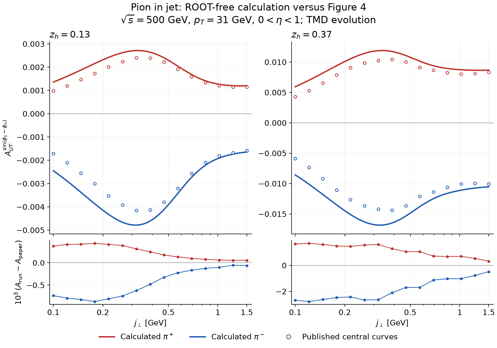

# A ROOT-free Python tutorial for pion-in-jet calculations

This folder wraps the numerical Fortran/C++ in PIONINJET with Python. It
calculates central charged-pion Collins asymmetries for the proton–proton
kinematics of Figure 4 in
[Kang, Prokudin, Ringer and Yuan, arXiv:1707.00913v2](https://arxiv.org/abs/1707.00913v2).
Python handles configuration, integration, tables and plotting. The supplied
hard-scattering routines, DSS/DSSV interpolation and custom transversity
HOPPET remain native code. ROOT, Cuba, Minuit, cfortran and Pythia are not
dependencies of this tutorial.

**Status: the implementation checks pass, but the evolved central curves do
not yet reproduce the paper precisely.** At the smallest plotted transverse
momentum their magnitudes are about 38–45% larger. The discrepancy falls to
about 4–5% at the largest point. No parameters or normalization were fitted
to the figure. Read the [numerical audit](AUDIT.md) before interpreting this
as a reproduction of the published result.



The numerical source is pinned to upstream commit
`3945b91086dd153b4d940531e2f09f8f70c0496f`. Everything added for this tutorial
lives in this folder; preparing and building it does not modify the original
source files or grids.

## 1. Set up the dependencies

The tested build uses Linux, GNU C++/Fortran 14, Make, LHAPDF 6.5.6 and
Python 3.12.9. Python package versions in the saved run are NumPy 2.5.2,
SciPy 1.18.0 and Matplotlib 3.11.1. The build script uses GNU Fortran flags
and a Linux shared library. A native macOS build has not been validated.

You need an existing LHAPDF 6 installation with C++ headers and library, a
C++17 compiler, GNU Fortran 10 or newer, and Make. The native routines need
Fortran even though the user interface is Python. LHAPDF's Python bindings
are not needed. See the [LHAPDF installation instructions](https://www.lhapdf.org/install.html)
if the C++ library is not available on your machine.

From the repository root:

```sh
cd tutorials/python_root_free
python3 -m venv .venv
source .venv/bin/activate
python3 -m pip install -r requirements.txt

# Replace these paths with your installation and PDF-data directory.
export LHAPDF_PREFIX=/path/to/lhapdf
export LHAPDF_DATA_PATH=/path/to/pdfsets
export FC=gfortran
export CXX=g++
```

The data directory must contain `CT10nlo/CT10nlo.info` and
`CT10nlo/CT10nlo_0000.dat` for the evolved calculation. Figure 5 also needs
`cteq6l1/cteq6l1.info` and `cteq6l1/cteq6l1_0000.dat`. Both saved runs used
data version 4. Only member zero is evaluated. If you use the LHAPDF data
manager, install the sets with:

```sh
lhapdf install CT10nlo
lhapdf install cteq6l1
```

Those commands can install all members, although this tutorial needs only
member zero. PDF data are external dependencies, not vendored here. The
fragmentation and polarized-distribution grids already supplied in this
repository are copied into the private build directory.

## 2. Build the small native backend

```sh
python3 prepare.py
bash build.sh
```

`prepare.py` extracts selected functions, copies the Fortran sources and
four parameter files, and verifies the numerical source against the pinned
upstream commit. Use a normal Git clone with that commit available, not a
source ZIP. The generated source and library live in `build/`, which is
ignored by Git. The custom HOPPET 1.1.5 source in this repository is required;
a stock HOPPET installation is not a replacement for its transversity scheme.

Legacy Fortran emits warnings about old DO syntax and dummy-array dimensions
under GNU 14. The recorded build completes with the stated compiler flags;
these warnings have not been hidden by rewriting the original routines.

## 3. Run the calculation and make the figures

```sh
python3 reproduce.py
```

This runs Figure 4 at two quadrature resolutions, generates the comparison
plot, and checks the Gaussian and evolved unpolarized Figure 5 curves. It
creates `results/`; the checked-in `example_results/` remains available as
a reference. Subsequent runs overwrite the generated files in `results/`.

For the full numerical audit:

```sh
python3 reproduce.py --convergence --audit
```

The additional checks halve the HOPPET grid spacing, extend the impact-
parameter interval, and independently integrate the original C++ routine.
The central calculation including order doubling took about 8 seconds on
the tested CPU; the independent four-dimensional check took about 31 seconds.
These are measurements, not runtime guarantees.

To run the pieces separately:

```sh
python3 pionjet.py --order 32 --output results/central
python3 plot_comparison.py --results results/central \
  --reference reference/paper_figure4_vector.csv --output results/comparison
python3 figure5.py --evolved results/central \
  --reference reference/paper_figure5_vector.csv --output results/figure5
python3 validation/audit.py --output results/audit.json
```

Plotting the saved Figure 4 results alone requires no compiled backend:

```sh
python3 plot_comparison.py --results example_results/central \
  --reference reference/paper_figure4_vector.csv --output results/saved_plot
```

## 4. Understand the calculation

All momenta and scales are in GeV; the impact parameter `b` is in inverse GeV.
The default kinematics are `sqrt(s)=500`, `pt=31`, `z=0.13,0.37`,
`0<y<1`, and `0.1<=jt<=1.5`. At this order the jet rapidity and
pseudorapidity coincide. The two pion charges share the same hard weights;
charge conjugation changes the fragmentation flavor ordering.

1. Read the KANG2015 central transversity and Collins parameters. Form the
   transversity input from CT10nlo and DSSV at `Q0=sqrt(2.4)` and the Collins
   input from the root-directory NLO fragmentation table.
2. Evolve these inputs with the author's custom HOPPET transversity scheme
   (`scheme=5`, one-loop evolution). HOPPET stores `x*f(x)`; the interface
   divides by `x` when returning distributions.
3. Integrate the incoming parton luminosities and the original hard kernels
   over rapidity and `xb`, keeping seven outgoing-flavor weights. The flavor
   order is `u, d, ubar, dbar, s, sbar, g` throughout the Python API.
4. At each `b`, evaluate the unpolarized and Collins matching convolutions
   at `mu_b=2 exp(-gamma_E)/b_star`, where
   `b_star=b/sqrt(1+b*b/1.5**2)`. Include the original perturbative Sudakov,
   nonperturbative broadening and Gaussian factors.
5. Integrate with `J0(b*jt/z)` for the denominator and `J1(b*jt/z)` for the
   spin-dependent numerator. The repository's Trento conversion fixes the
   numerator sign. The outgoing gluon TMD is explicitly zero; incoming
   gluons and gluon-to-quark matching are retained.
6. Contract the flavor weights and take `A_UT=FUT/FUU`.

Step 3 can be done once because at fixed `pt` the fragmentation factors are
independent of `xa`, `xb`, and `y`. This is an algebraic separation of the
integral, with an explicit numerical check against the unseparated C++
integrand. Gauss–Legendre quadrature replaces the original Vegas integration;
the `b` interval is split into shorter pieces for the Bessel integrals.

For an interactive Python session launched in this folder:

```python
import numpy as np
from pionjet import Backend, asymmetry

engine = Backend()                 # initializes PDF grids and HOPPET once
weights = engine.hard(500., 31., n=64)
jt = np.array([0.1, 0.5, 1.5])
tmd = engine.tmd(0.37, 31., jt, n=64)
a_plus, fuu, fut = asymmetry(weights, tmd, charge=1)
print(a_plus)  # approximately [0.00594409, 0.01079433, 0.00869058]
```

The native libraries contain global state. Create only one `Backend` per
process and use separate processes for different initializations; concurrent
threads are unsupported. The wrapper restores the working directory after
Fortran table access.

## 5. Change a setting explicitly

```sh
python3 pionjet.py --z .37 --pt 31 --energy 500 --order 32 \
  --output results/one_z
python3 pionjet.py --matching unit-delta --output results/unit_delta
```

`--order n` calculates at both `n` and `2n`, saving the latter as the result.
`--dy` controls the HOPPET grid. `--bmin` and `--bmax` control the numerical
Fourier interval; they do not change the fixed `b_star` parameter of 1.5.
Changing `pt` changes both the hard and TMD evolution scales. The rapidity
window is fixed at `[0,1]`. Only the stated Figure 4 kinematics have been
benchmarked against the paper; other inputs are exploratory calculations.

Matching choices are deliberately named by what they change:

| Option | Delta term | Other matching terms |
|---|---|---|
| `repository` (default) | `1-2 CF alpha_s/pi` | Original one-loop terms |
| `unit-delta` | 1 | Same one-loop terms |
| `tree` | 1 | Dropped |

`unit-delta` changes only the delta term to the one printed in Eqs. (8),(10);
it is not an implementation of every printed convention. `tree` still has
TMD evolution and is not the no-evolution fit used for the dashed curves.

`--pdfset cteq6l1 --ff-order 0` selects the uploaded driver's default
unpolarized inputs. The Collins initial condition still uses NLO FFs, just
as the original `pdf_init` does. The tutorial default CT10nlo/NLO choice
follows the inputs associated with the evolved KANG2015 fit.

## 6. Read the outputs and inspect the code

| File | Contents |
|---|---|
| `results/central/figure4_curves.csv` | `z`, charge, `jt`, refined/coarse `A_UT`, reduced `FUU/FUT` |
| `results/central/run.json` | Settings, source/parameter hashes, package versions, validation residuals |
| `results/comparison/` | Figure 4 PNG/SVG and discrepancy metrics |
| `results/figure5/` | Figure 5 PNG/SVG, both differential conventions and gluon checks |
| `results/audit.json` | Independent original-integrand estimates, errors and seeds |
| `results/convergence.json` | HOPPET-spacing and Fourier-range sensitivity |
| `prepare.py`, `build.sh` | Source extraction and native build |
| `bridge.cpp` | C ABI, LHAPDF 6 interface and initial conditions |
| `pionjet.py` | Physics configuration, matching and deterministic integration |
| `validation/reference.cpp` | Minimal adapter for the complete original C++ integrand |
| `reference/` | Vector-extracted paper points and extraction provenance |

Reduced cross sections omit the original driver's common
`alpha_s(pt)**2 * 2*jt`; they still contain its `2*pt` factor. They are not
the Cartesian differential cross sections in the paper's axis label.
[AUDIT.md](AUDIT.md) explains the Figure 5 normalization test.

The no-evolution Collins asymmetry and uncertainty bands are not included.
The corresponding legacy transversity grids are missing from the snapshot.
This is the pp calculation; it does not implement the EIC paper
arXiv:2007.07281. See [CITATIONS.md](CITATIONS.md) for attribution.
